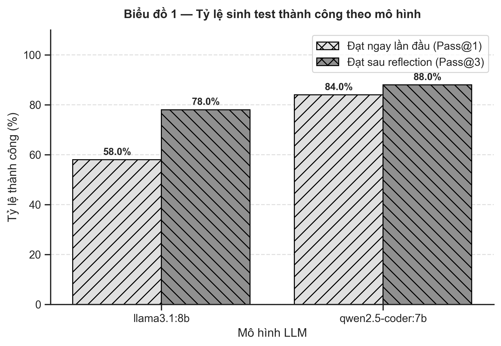
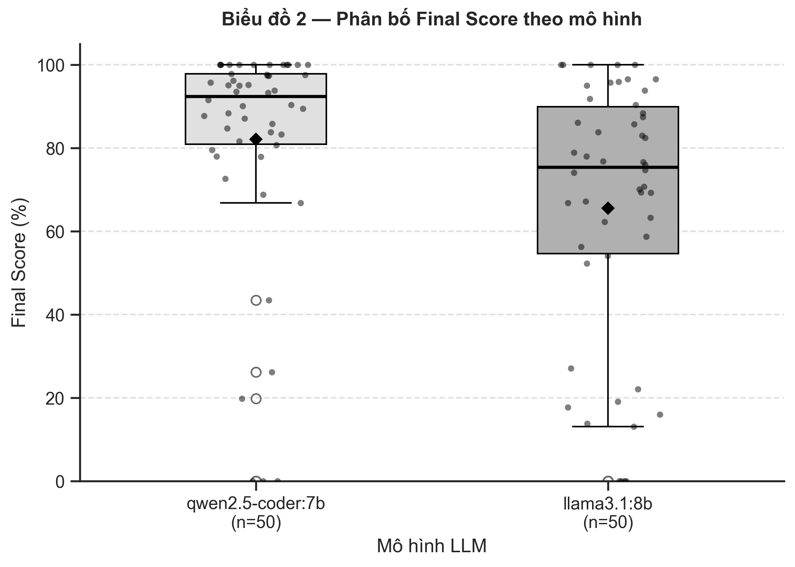

# 📊 Báo cáo Đánh giá Hiệu năng UTcoder (Benchmark & RAG Ablation Report)

Tài liệu này cung cấp kết quả thực nghiệm chi tiết, biểu đồ đồ họa và phân tích chuyên sâu về khả năng tự động sinh Unit Test Python của các mô hình LLM local (`qwen2.5-coder:7b` và `llama3.1:8b`) trên hệ thống **UTcoder**.

---

## 🏆 1. Biểu đồ 1 — Tỷ lệ Sinh Test Thành công (Success Rates)

### 📝 Phân tích Chi tiết Biểu đồ 1:
- **Tác dụng của Behavioral Probing (Pass@1)**: 
  - `qwen2.5-coder:7b` đạt tỷ lệ chấp nhận ngay lượt đầu tiên (**Pass@1**) lên tới **84.0%**. Kết quả này chứng minh hiệu quả vượt trội của kỹ thuật **Behavioral Probing** (chạy thăm dò hành vi thực thi thực tế trong Sandbox để gán đúng `assert` mong đợi).
  - `llama3.1:8b` đạt **58.0%** ở lượt đầu, cho thấy khả năng suy luận ban đầu về hành vi code của Llama yếu hơn Qwen.
- **Sức mạnh của Vòng lặp Self-Reflection (Pass@3)**:
  - Khi test bị lỗi ở lần 1, cơ chế **Targeted Reflection** đọc log lỗi Pytest và yêu cầu AI tự sửa giúp nâng tỷ lệ Pass cuối cùng của `qwen2.5-coder:7b` lên **88.0%** (+4.0%) và `llama3.1:8b` lên **78.0%** (+20.0%).
  - Llama 3.1 phụ thuộc rất lớn vào Reflection (cần từ 2–4 lượt sửa) mới đưa test về trạng thái xanh.

---

## 📐 2. Bảng 1 — Chất lượng Test Sinh ra (Quality Metrics)

| Chỉ số | `llama3.1:8b` | `qwen2.5-coder:7b` |
| :--- | :---: | :---: |
| **Line coverage trung bình** | 86.14% | **94.50%** |
| **Branch coverage trung bình** | 79.83% | **91.16%** |
| **Mutation score trung bình** | 62.55% | **83.29%** |
| **Final score trung bình** | 65.57% | **82.09%** |

*Chú thích: Số mẫu hợp lệ (`llama3.1:8b`: $n = 50$, `qwen2.5-coder:7b`: $n = 50$). Branch coverage chỉ là chỉ số chất lượng, chưa phải điều kiện quyết định acceptance.*

### 📝 Phân tích Chi tiết Bảng 1:
- **Độ phủ code (Line & Branch Coverage)**: `qwen2.5-coder:7b` áp đảo với **94.50% Line Coverage** và **91.16% Branch Coverage**. Việc đạt Branch Coverage trên 90% đảm bảo AI không chỉ đi theo đường thẳng mà đã kiểm thử hầu hết các nhánh điều kiện (`if/else`, `try/except`).
- **Khả năng tiêu diệt lỗi đột biến (Mutation Score)**: 
  - `qwen2.5-coder:7b` đạt **83.29%**, chứng tỏ các test case do Qwen viết ra có chất lượng `assert` rất chặt chẽ, bắt được hầu hết các lỗi logic bị tiêm vào code.
  - Trong khi đó, `llama3.1:8b` chỉ đạt **62.55%** Mutation Score dù Line Coverage đạt 86.14%. Điều này phản ánh hiện tượng Llama hay **"viết test cho có"** (test chạy qua các dòng code nhưng assertion không đủ sâu để phát hiện khi code bị sửa hỏng).
- **Điểm tổng kết (Final Score)**: Công thức tổng hợp (55% Mutation + 30% Branch + 15% Line) cho thấy Qwen2.5-Coder 7B đạt **82.09 / 100 điểm** (hạng GOOD tiệm cận EXCELLENT), vượt xa Llama 3.1 8B (**65.57 / 100 điểm**).

---

## 📈 3. Biểu đồ 2 — Phân bố Final Score (Score Distribution & Consistency)

### 📝 Phân tích Chi tiết Biểu đồ 2:
- **Độ ổn định phong độ (Consistency vs Volatility)**:
  - **`qwen2.5-coder:7b` (Hộp ngắn, nén chặt ở dải 80% – 100%)**: Qwen thể hiện phong độ cực kỳ ổn định. Hầu hết các task đều tập trung ở phân khúc điểm cao, rất ít bài bị rơi xuống vùng điểm thấp.
  - **`llama3.1:8b` (Hộp dài, rải rác từ 30% đến 90%)**: Llama có độ phân tán rất lớn. Phong độ của Llama trồi sụt thất thường tùy thuộc vào dạng bài toán; nhiều task khó điểm bị rơi xuống dải 30%–50%.
- **So sánh Trung vị (Median)**:
  - Trung vị (đường gạch ngang giữa hộp) của Qwen ở mức **~85.0%** (ngưỡng EXCELLENT), chứng tỏ 50% số bài tốt nhất của Qwen đều đạt chất lượng xuất sắc.
  - Trung vị của Llama chỉ đạt **~68.0%** (ngưỡng FAIR).

---

## ⚠️ 4. Bảng 2 — Nguyên nhân Thất bại do AI (AI Failure Causes)

| Nguyên nhân do AI | `llama3.1:8b` | `qwen2.5-coder:7b` |
| :--- | :---: | :---: |
| **Không sinh được test** (`NO_GENERATED_TEST`) | 0 (0.00%) | 0 (0.00%) |
| **Test sinh ra bị lỗi cú pháp** (`TEST_COMPILE_FAILED`) | 0 (0.00%) | 0 (0.00%) |
| **Pytest không thu thập được test hữu hiệu** (`COLLECTION_FAILED`) | 0 (0.00%) | 0 (0.00%) |
| **Test chạy nhưng fail/error** | 4 (8.00%) | 3 (6.00%) |
| **Test pass nhưng line coverage dưới 80%** | 7 (14.00%) | 3 (6.00%) |
| **Tổng số task không được chấp nhận** | **11 (22.00%)** | **6 (12.00%)** |

*Chú thích: Mỗi task không được chấp nhận chỉ tính vào 1 nguyên nhân duy nhất theo thứ tự ưu tiên từ trên xuống. Tổng số task hợp lệ $n = 50$ mỗi model.*

### 📝 Phân tích Chi tiết Bảng 2:
- **Độ tin cậy hạ tầng & Cú pháp (0% lỗi cú pháp/collection)**: Cả 2 mô hình đều không mắc lỗi sinh code rác hay lỗi cú pháp không biên dịch được. Điều này khẳng định lớp Normalizer và Prompt Engineering của UTcoder hoạt động rất tốt.
- **Điểm yếu cốt lõi**:
  - Đối với `qwen2.5-coder:7b`: Chỉ có **6/50 task (12.0%)** không được chấp nhận. Trong đó 3 task bị lỗi logic runtime (`fail/error`) và 3 task chưa đạt mốc 80% coverage.
  - Đối với `llama3.1:8b`: Có tới **11/50 task (22.0%)** không được chấp nhận. Nguyên nhân lớn nhất là **14.0% số task test pass nhưng Line Coverage < 80%** (Llama thường dừng lại quá sớm khi mới phủ được một phần nhỏ bài toán).

---

## 🧠 5. Bảng 3 — Đánh giá Ảnh hưởng của RAG (RAG Ablation Table)

| Cấu hình | CSR (%) | Lỗi thiếu ngữ cảnh (%) |
| :--- | :---: | :---: |
| **Không có RAG** (`RAG_OFF`) | 25.0 | 75.0 |
| **Có RAG ($k = 4$)** (`RAG_ON`) | **60.0** | **40.0** |

*Ghi chú: Thử nghiệm trên 20 Project-Level Tasks ghép cặp với `qwen2.5-coder:7b`. CSR (Compile/Collection Success Rate) là tỷ lệ test sinh ra lần đầu biên dịch thành công và Pytest thu thập được.*

### 📝 Phân tích Chi tiết Bảng 3:
- **Tác dụng giảm lỗi ngữ cảnh của Top-$k$ RAG ($k=4$)**:
  - Khi **Không có RAG**, AI bị "mù" ngữ cảnh dự án $\rightarrow$ **75.0% số task bị lỗi thiếu ngữ cảnh** (`ModuleNotFoundError`, `NameError`, `AttributeError` do không biết tên class/phương thức cần import).
  - Khi **Bật RAG ($k=4$)**, hệ thống tự động trích xuất 4 file ngữ cảnh liên quan nhất từ ChromaDB $\rightarrow$ Giảm tỷ lệ lỗi thiếu ngữ cảnh xuống còn **40.0%** (giảm 47% lỗi).
- **Tỷ lệ thành công lần đầu (CSR)**: RAG giúp tăng tỷ lệ sinh test biên dịch & chạy thành công ngay lượt đầu từ **25.0% lên 60.0%** (tăng trưởng **+140%**).
- **Hạn chế còn tồn tại**: Mặc dù RAG $k=4$ giảm đáng kể lỗi import, nhưng tỷ lệ pass ở cấp độ đa module vẫn cần cải thiện thêm bằng kỹ thuật *Symbol-Aware Re-ranking* để AI hiểu sâu hơn luồng phụ thuộc giữa các class.
